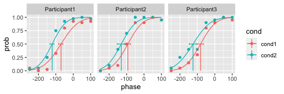

<!-- README.md is generated from README.Rmd. Please edit that file -->

# quickpsy

<!-- badges: start -->

<!-- badges: end -->

quickpsy is an R package developed by [Daniel
Linares](http://www.dlinares.org) and [Joan
López-Moliner](http://www.ub.edu/viscagroup/joan/) to quickly fit and
plot psychometric functions for multiple conditions.

You can find more information at the
[website](http://www.dlinares.org/quickpsy.html).

## Installation

You can install the released version of quickpsy from
[CRAN](https://CRAN.R-project.org) with:

``` r
install.packages("quickpsy")
```

And the development version from [GitHub](https://github.com/) with:

``` r
# install.packages("devtools")
devtools::install_github("danilinares/quickpsy")
```

At present, the development version of `quickpsy` is slower than older
versions. If you need to perform bootstrap for many conditions you might
want to use an older version.

## Example

``` r
library(quickpsy)

fit <- quickpsy(qpdat, phase, resp, grouping = c("participant", "cond"))

plot(fit, color = cond)
```



## Features

  - Fits and plots multiple conditions with minimal coding.

  - The user does not need to introduce initial parameters for default
    shapes of the psychometric functions.

  - Calculates parametric and non-parametric bootstrap confidence
    intervals.

  - Compares parameters and thresholds for different conditions using
    bootstrap.

  - Guess and lapses can be fixed or free as parameters.

  - Fits cumulative normal, logistic, weibull functions or any function
    defined by the user.

  - Facilitates the reading of several data files.

### Development version (at present it is slower than the CRAN version)

  - Different conditions could share parameters.

  - Easy model comparisons using likelihood ratios or Akaike Information
    Criterion.

## Citation

Linares, D., & López-Moliner, J. (2016). [quickpsy: An R package to fit
psychometric functions for multiple
groups.](https://journal.r-project.org/archive/2016/RJ-2016-008/index.html)
The R Journal, 2016, vol. 8, num. 1, p. 122-131.

## Other R packages to fit psychometric functions

  - [psyphy](http://cran.r-project.org/web/packages/psyphy/index.html):
    among other things, it provides links functions to [fit psychometric
    functions using an approach based on generalized linear
    models](http://www.dlinares.org/psychopract.html#fitting-using-generalized-linear-models).

  - [modelfree](http://personalpages.manchester.ac.uk/staff/d.h.foster/software-modelfree/latest/home):
    fits psychometric functions using a non-parametric approach.
